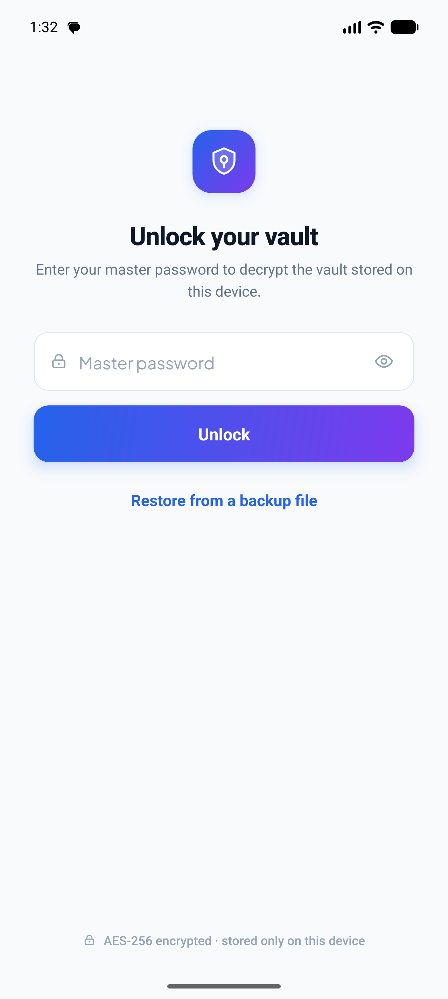
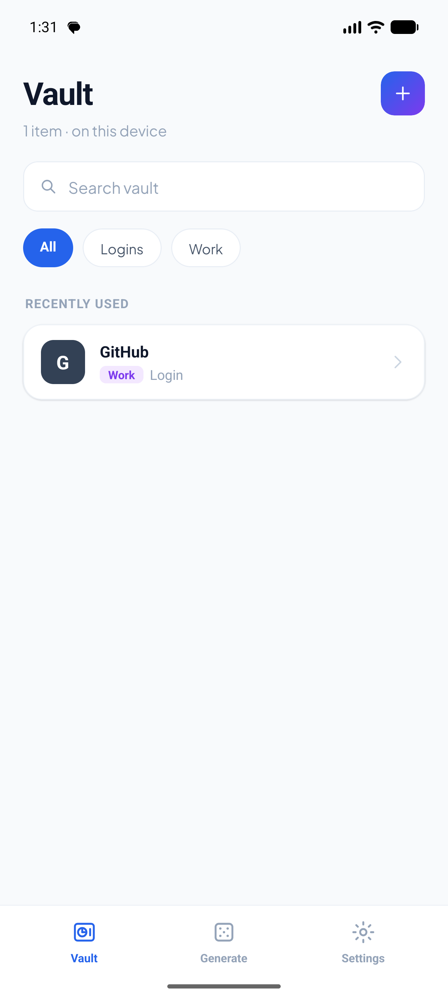
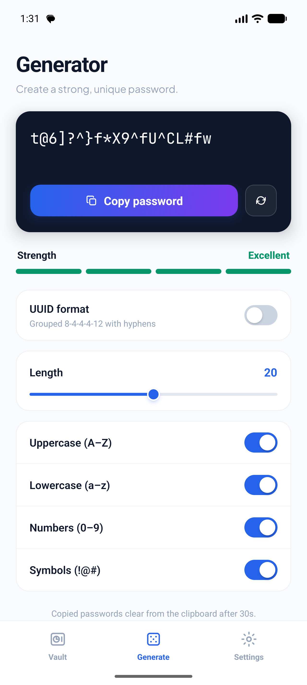
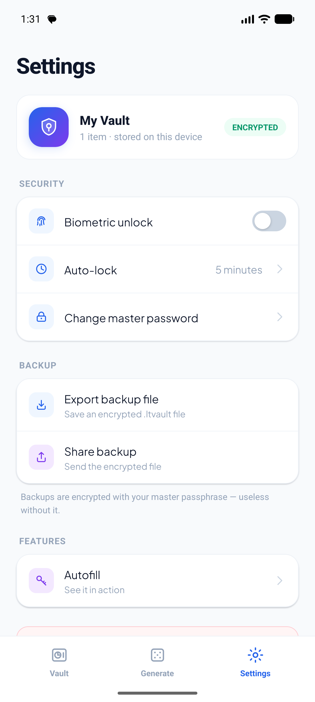

# Larateam Vault

A personal, offline-first password & secret manager for Android. Your data is encrypted on your own device with a master passphrase and **never leaves your phone** — no servers, no accounts, no sync, no telemetry.

## Screenshots

<p align="center">
  
  
  
  
</p>

<p align="center"><sub>Unlock · Vault · Generator · Settings</sub></p>

## Features
- **Bottom-tab app** — Vault · Generate · Settings, in a clean blue/violet light theme with a hand-built SVG icon set.
- **Item types** — Logins, Passwords, Cards, Secure Notes, Identities, with search, category filters, favorites, and custom fields.
- **Password generator** — character passwords (length + class toggles, avoid-ambiguous) and word passphrases, with a live strength meter. All randomness comes from the platform CSPRNG.
- **One-time codes (TOTP)** — RFC 6238 codes generated on-device (pure-JS HMAC-SHA1), with a countdown ring.
- **Weak-password flags** — entries with weak password material are flagged inline in the vault list, using the same on-device strength check as the generator. Nothing leaves the phone.
- **Android Autofill** — fill saved logins into other apps and browsers through the system Autofill service, unlocked with your master passphrase.
- **Biometric unlock** — optional fingerprint/face unlock, with the master passphrase held in the Android Keystore.
- **Auto-lock** — locks when the app goes to the background, on a delay you choose.
- **Clipboard auto-clear** — copied secrets are wiped from the clipboard after 30 seconds.

## How the security works
- **Argon2id** turns your master passphrase into a 256-bit key — deliberately slow, to make guessing attacks impractical (64 MB memory, 3 iterations).
- **AES-256-GCM** encrypts your data and detects any tampering. A fresh random salt is generated on every save.
- Only the **encrypted vault** is stored. Without your passphrase the data cannot be read — by anyone, including you.

> ⚠️ **No recovery.** If you forget your master passphrase, the data is gone for good. Write it down and keep it somewhere safe.

## The `.ltvault` format
The vault is never written to disk as JSON. It is packed into a custom binary container — magic bytes `LTVT`, a version, the Argon2 parameters, and the salt / IV / GCM tag / ciphertext — then base64-armored between `BEGIN/END LARATEAM VAULT` banners. The same container is used for on-device storage and for exported `.ltvault` backups. The artifact is opaque ciphertext end to end.

## Tech stack
React Native 0.86 (TypeScript) · Argon2id + AES-256-GCM · react-native-svg · react-native-keychain · AsyncStorage. React hooks for state — no Redux/MobX.

## Prerequisites (Windows)
- Node.js **22.11+**
- **JDK 17** (exactly 17 — higher versions break the build)
- Android Studio with **SDK Platform 35** and **Build-Tools 36.0.0**
- `ANDROID_HOME` set, and `…\platform-tools` on your `PATH`

## Setup
```bash
npm install
```

## Run on your phone
1. On the phone: enable **Developer options → USB debugging**, connect via USB, accept the trust prompt.
2. Confirm it's seen: `adb devices`
3. Run:
   ```bash
   npm run android
   ```
   Native deps changed since first install will be linked on this build; a JS-only change just needs a Metro reload.

## Build a standalone APK
```bash
cd android
gradlew assembleDebug
```
APK output: `android/app/build/outputs/apk/debug/app-debug.apk` — copy it to your phone and tap to install (allow "install from unknown sources"). A debug APK is fine for personal use.

## Project structure
```
App.tsx                       # state machine + tab/overlay router + persistence
index.js                      # entry; registers the app + autofill root
src/model.ts                  # item model + v1→v2 migration
src/ltvault.ts                # the .ltvault encrypted container format
src/vaultCrypto.ts            # Argon2id key derivation + AES-256-GCM
src/vaultStorage.ts           # encrypted-container storage (AsyncStorage)
src/vaultBackup.ts            # export / import .ltvault files
src/passwordGen.ts            # generator + strength scorer (CSPRNG)
src/totp.ts                   # RFC 6238 one-time codes (pure JS)
src/biometric.ts              # Keystore-backed biometric unlock
src/clipboard.ts              # copy with auto-clear
src/laraTheme.ts              # design tokens — blue/violet light-surface palette
src/icons.tsx                 # SVG icon set
src/components/lara/*         # button / field / row / chip / tab-bar component library
src/screens/lara/*           # Unlock, Onboarding, VaultList, ItemDetail, ItemEditor,
                             #   Generator, Settings, TypePicker, Autofill
src/session/*                # useVaultSession, useAutoLock, useAppBackHandler hooks
src/autofill/*               # Autofill UI + JS↔native bridge
android/app/src/main/java/com/larateam/myvault/autofill/*   # native Autofill service (Kotlin)
```

## Backups (multiple locations, safely)
A `.ltvault` backup is pure **ciphertext**, so it's safe to copy anywhere — Google Drive, a USB stick, another PC. Use **Settings → Save to file / Share backup**; restore by importing it from the Unlock screen. Follow the **3-2-1 rule**: 3 copies, on 2 types of media, with 1 kept offsite.

## Troubleshooting
- **Build fails on a native module** → set `newArchEnabled=false` in `android/gradle.properties`, then rebuild.
- **App shows a red screen / can't load bundle** → make sure Metro is running (`npm start`) and run `adb reverse tcp:8081 tcp:8081`.
- **`adb` not recognized** → reopen the terminal; check `ANDROID_HOME` and `PATH`.
- **Wrong Java version** → `java -version` must show `17`.

## Notes
After dependencies are installed, it builds and runs entirely offline. The only data that ever leaves the phone is an encrypted `.ltvault` you explicitly export.

## License
Released under the **GNU General Public License v3.0** — see [`LICENSE`](LICENSE). You may use, study, share, and modify it; derivative works must remain under the GPL-3.0. The software is provided without warranty.
